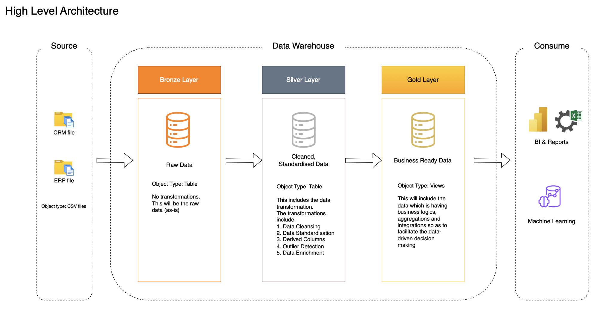

# 🧠 SQL Data Analytics Project - CRM & ERP Integration

This project is a comprehensive end-to-end SQL-based data pipeline that unifies customer and product data from two core enterprise systems — CRM and ERP — into a centralized data warehouse. Built using the Medallion Architecture, it transforms raw operational data into trusted, analytics-ready datasets that drive better business decisions. By systematically cleaning, enriching, and integrating the data, the project enables reliable reporting and deep business insights through a star schema model. It supports key business use cases such as understanding customer lifetime value, tracking product performance, analyzing revenue trends, segmenting customers based on behavior, and measuring core KPIs like recency, frequency, and monetary value. With this foundation, the business gains a 360-degree view of its operations — helping stakeholders identify growth opportunities, optimize customer engagement, streamline product strategy, and make data-informed strategic choices across sales, marketing, and operations.

> 📍 **Repository:** [SQL Project GitHub Repo](https://github.com/advaitkadam2505/sql-project)

---

## 📌 Objective

To design a scalable and analysis-ready SQL-based data pipeline that consolidates multi-source data, enables exploratory and advanced analytics, and produces KPI-driven insights to support data-informed decision-making.

---

## 🏗️ Architecture

This project adopts the **Medallion Architecture** (Bronze → Silver → Gold) and is built around the **Star Schema** model for the gold layer.

📁 **Bronze Layer** – Raw ingestion  
📁 **Silver Layer** – Cleaned and standardized data  
📁 **Gold Layer** – Business-friendly dimensional views



---

## 🧾 Source Systems

**1. CRM System**  
- `cust_info.csv`  
- `prd_info.csv`  
- `sales_details.csv`

**2. ERP System**  
- `CUST_AZ12.csv`  
- `LOC_A101.csv`  
- `PX_CAT_G1V2.csv`

These datasets include customer records, product information, transactional sales data, geographic location, and product hierarchy.

---

## 🔃 ETL Workflow

### 🔸 Bronze Layer
- Schema creation: `bronze_layer/ddl_bronze_layer.sql`
- Data load initialization: `bronze_layer/init_database.sql`

### 🔸 Silver Layer
- Data cleansing & transformation: `silver_layer/data_cleansing.sql`
- Enrichment and standardization (e.g., date parsing, null handling, sales calculations)
- Schema creation: `silver_layer/ddl_silver_layer.sql`

### 🔸 Gold Layer
- Final fact and dimension views for business users:
  - `gold_fact_sales.sql`
  - `gold_dim_customers.sql`
  - `gold_dim_products.sql`

> Relationships modeled using the **Star Schema** for optimal analytical querying.

---

## 📊 Exploratory Data Analysis (EDA)

Directory: `scripts/EDA`

Scripts used:
- `dim_date_exploration.sql`
- `dim_measure.sql`
- `measure_report.sql`
- `metadata_exploration.sql`
- `top_performers.sql`

Focus areas:
- Understanding data distributions
- Validating completeness and granularity
- Identifying high-performing entities

---

## 📈 Advanced Analytics

Directory: `scripts/Advanced Analytics`

Analysis modules include:
- `time_trends.sql` – Monthly trends in revenue and quantity
- `cumulative_analysis.sql` – Running totals for growth tracking
- `part_to_whole.sql` – Category-wise contribution to sales
- `data_segmentation.sql` – Customer segments (VIP, Regular, New)
- `performance_analysis.sql` – Benchmarked product performance
- `customer_report.sql` – KPIs: Recency, AOV, Monthly Spend
- `product_report.sql` – KPIs: Recency, AOR, Avg Monthly Revenue

These insights help businesses:
- Target high-value customers
- Improve product assortment
- Track seasonality and growth
- Create performance benchmarks

---

## ✅ Data Quality Checks

Directory: `tests`

- `quality_check_silver.sql`  
- `quality_check_gold.sql`  

Checks for:
- Nulls, incorrect data types
- Invalid joins or orphan records
- Metric validation (e.g., derived sales = price × quantity)

---

## 📂 Repository Structure
```
sql-project
├── datasets/
│ ├── CRM/
│ │ ├── cust_info.csv
│ │ ├── prd_info.csv
│ │ └── sales_details.csv
│ └── ERP/
│ ├── CUST_AZ12.csv
│ ├── LOC_A101.csv
│ └── PX_CAT_G1V2.csv
│
├── docs/
│ ├── data_architecture.png
│ ├── data_flow.png
│ └── data_integration.png
│
├── scripts/
│ ├── Advanced Analytics/
│ │ ├── cumulative_analysis.sql
│ │ ├── customer_report.sql
│ │ ├── data_segmentation.sql
│ │ ├── part_to_whole.sql
│ │ ├── performance_analysis.sql
│ │ ├── product_report.sql
│ │ └── time_trends.sql
│ ├── EDA/
│ │ ├── dim_date_exploration.sql
│ │ ├── dim_measure.sql
│ │ ├── measure_report.sql
│ │ ├── metadata_exploration.sql
│ │ └── top_performers.sql
│ ├── bronze_layer/
│ │ ├── ddl_bronze_layer.sql
│ │ └── init_database.sql
│ ├── silver_layer/
│ │ ├── data_cleansing.sql
│ │ └── ddl_silver_layer.sql
│ └── gold_layer/
│ ├── gold_dim_customers.sql
│ ├── gold_dim_products.sql
│ └── gold_fact_sales.sql
│
├── tests/
│ ├── quality_check_gold.sql
│ └── quality_check_silver.sql
│
├── LICENSE
└── README.md
```
---

## 🧠 Key Business Insights Delivered

- 🎯 **Customer Segmentation**: Identify VIPs, Regulars, and New customers based on spend and engagement  
- 📦 **Product Performance**: Spot top and underperforming products across time  
- 📈 **KPI Monitoring**:
  - Customer: Recency, AOV, Avg Monthly Spend  
  - Product: Recency, AOR, Avg Monthly Revenue  
- 🌍 **Category-Level Contribution**: Understand sales contribution per product category  
- 📊 **Time Trend Analysis**: Track monthly performance and growth

---

## 🛠️ Tools Used

- **SQL** – Core ETL and analytics scripting  
- **Medallion Architecture** – Bronze, Silver, Gold layer design  
- **Star Schema** – For optimized reporting  
- **GitHub** – Version control & documentation  
- *(Optional tools: DB client like MySQL Workbench, DBeaver)*
